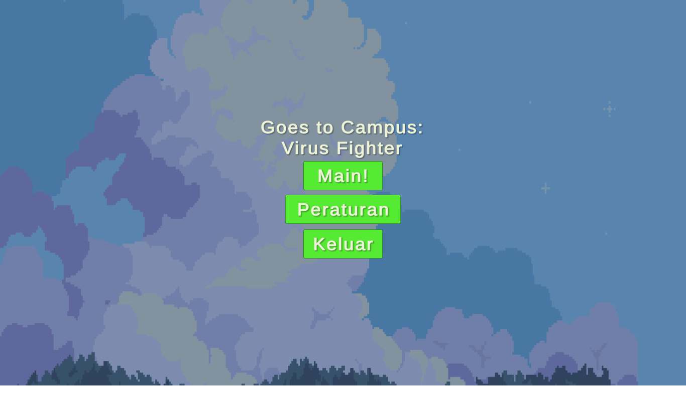
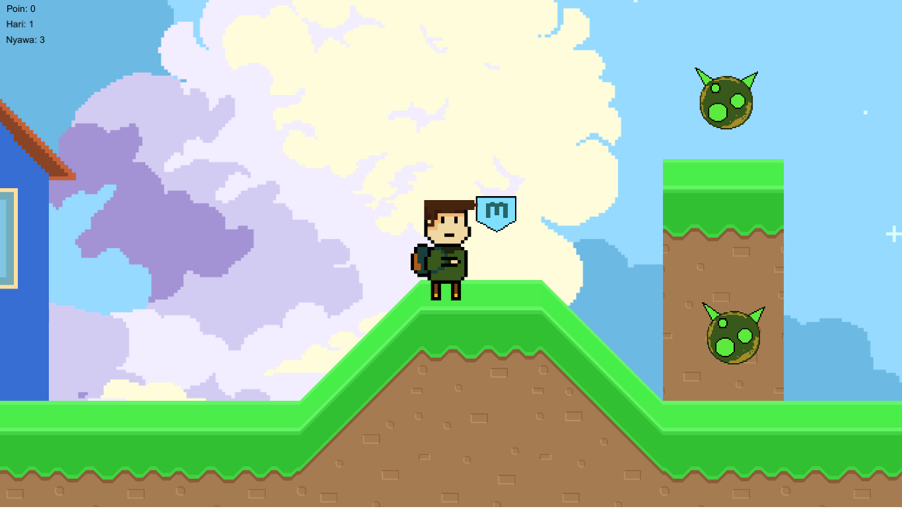
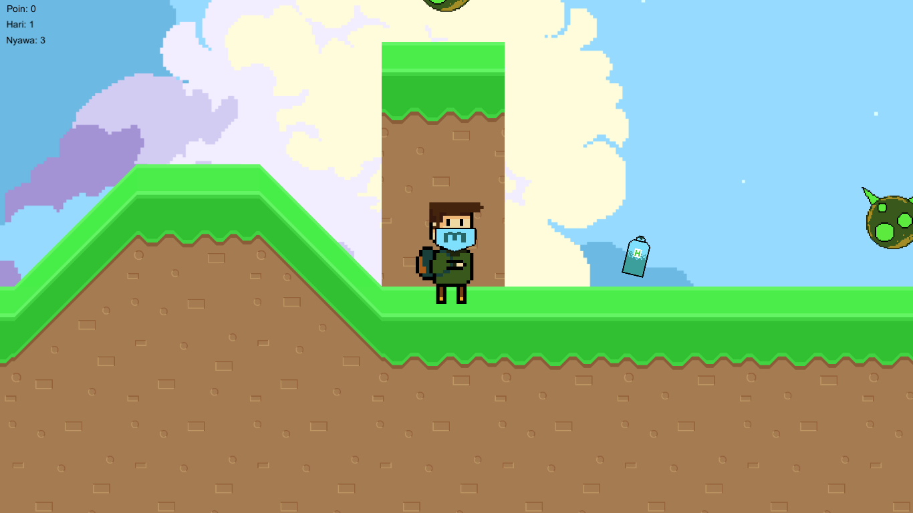

# Goes to Campus: Virus Fighter

## Roles
| No | Nama                   | Role            |
|----|------------------------|-----------------|
| 1  | Ahmad Tedy Murtadho    | Game Design     |
| 2  | Bintang Fikriguska     | Game Programmer |
| 3  | Yuda Baskara           | Game Artist     |

## Control
1. A, D / arrow kiri, arrow kanan : Untuk menggerakan karakter
2. S / ctrl : Melempar hand sanitizer
3. Space : lompat

## Story
Agri merupakan seorang mahasiswa di universitas ternama. Ia ingin berangkat kuliah ke kampusnya, tetapi karena suasana sedang pandemi Agri mendapatkan rintangan selama perjalanannya ke kampus. Rintangan tersebut berupa virus yang mengganggu sepanjang perjalanan. Agri harus menghadapi rintangan-rintangan tersebut untuk sampai ke kampus nya.

## Rules
- Virus tidak harus dikalahkan semua, tapi kalo kita bunuh dpt 1 poin score
- Virus dapat dibunuh dengan cara melemparkan hand sanitizer ke arah virus 
- Di awal dibekali 3 life point, jika terkena virus kita akan respawn di checkpoint terdekat dan life point berkurang 1
- Kalo life points = 0, kita kalah
- Kalo sampe kampus = kita menang
- Jika mendapat masker = kebal 1 hit

 
## Goals
Berhasil sampai ke kampus dengan selamat

## Assets
Sound :
- Musik dan sound in game : http://soundimage.org/
- Efek klik pada menu : https://www.zapsplat.com/sound-effect-categories/

Textures :
- Asset tanah : https://assetstore.unity.com/?category=2d&free=true&orderBy=1
- Background : https://itch.io/game-assets/free/tag-background
- Asset character, masker, hand sanitizer, kosan, dan kampus : Buat sendiri menggunakan pixel studio for pixel art melalui steam

## Teknologi yang Digunakan
- Pixel studio for pixel art : membuat asset game
- Unity3d 2019.4.13f1 : Game engine
- C# : Bahasa Pemrograman
- Unity Hub 2.4.2 : Platform Kolaborasi Projek
- Sublime Text 3.2.2: Text Editor
- Github : Dokumentasi Projek

## Screenshoot

